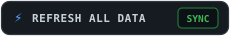
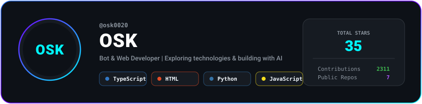
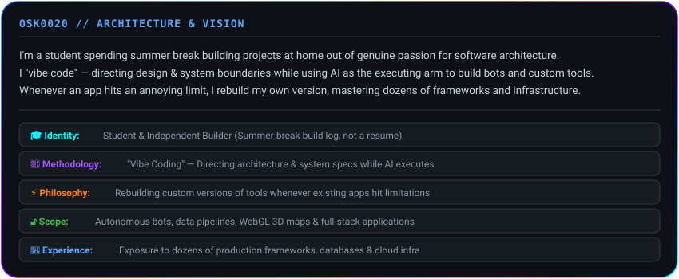
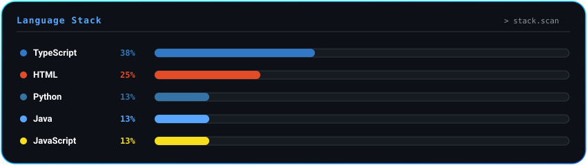
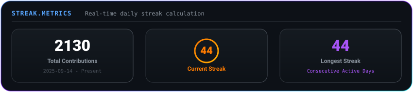
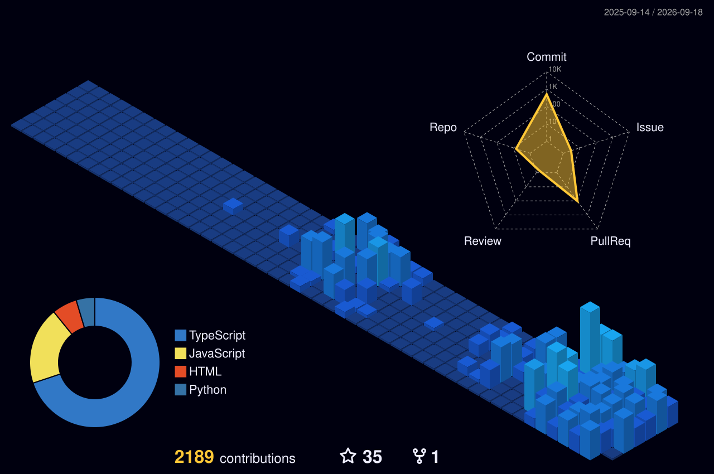

# ⚡ OSK0020 // STUDENT & AI-POWERED BUILDER

<div align="center">
  

  <br/><br/>
  <a href="https://github.com/OSK0020/OSK0020/actions/workflows/update-profile.yml">
    
  </a>
  <br/><br/>
  
</div>

---

## 📌 About Me

<div align="center">
  
</div>

---

## 🛠️ Tech Stack & Tools

<div align="center">
  
</div>

<br/>

### 💻 Languages
<p>
  
</p>

### 🌐 Web & Mobile
<p>
  
</p>

### ⚡ Backend & Cloud Infrastructure
<p>
  
</p>

### ☁️ Tools & Development Environment
<p>
  
</p>

### 🤖 AI Ecosystem & Autonomous Workflows
<p>
  
</p>

---

## 🚀 Projects I've Actually Built

<div align="center">
  
</div>


## 📊 GitHub Analytics & Streak Stats

<div align="center">
  
  <br/><br/>
  <a href="https://git.io/streak-stats" target="_blank">
    
  </a>
</div>

---

## 🏆 GitHub Achievements

<div align="center">
  
</div>

---

## 🧊 3D Contribution Graph

<div align="center">
  <picture>
    <source media="(prefers-color-scheme: dark)" srcset="./profile-3d-contrib/profile-night-view.svg" />
    <source media="(prefers-color-scheme: light)" srcset="./profile-3d-contrib/profile-green-animate.svg" />
    
  </picture>
</div>

---

## 📈 Live Contribution Heatmap

<div align="center">
  
</div>

---

## 🎯 Current Focus

```yaml
status:
  - Student, no degree yet, building because I like it
learning:
  - Whatever breaks when I try to rebuild something myself
  - New AI agent workflows & coding tools
building:
  - Bots and small tools I actually use
  - Side projects during summer break
exploring:
  - Antigravity, Lovable & UiPilot
open_to:
  - Collaborating on interesting builds
```

---

## 🎵 Spotify // Live Coding Beats

<div align="center">
  <a href="https://open.spotify.com/playlist/5l9o7NHJEYaDkql1uVyvTJ" target="_blank">
    
  </a>
</div>

---

## 📬 Connect

<div align="center">
  

  <br/><br/>

  <p><i>Let's build something useful together.</i></p>
</div>

---

<div align="center">
  <p><i>Still a student. Still figuring it out. AI writes the code — I decide what's worth building.</i></p>

  <br/>

  
</div>
